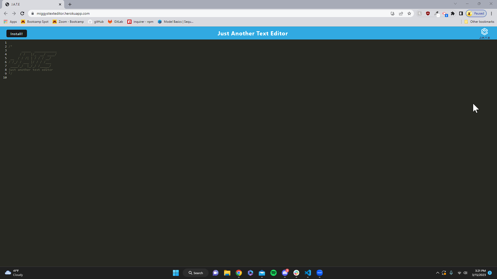

# Miggys Text Editor

## Description 
- This application was created to allow users 

## Table of contents
- [Description](#description)
- [Installation](#installation)
- [Usage](#usage)
- [Credits](#credits)
- [License](#license)
- [Badges](#badges)

## Installation 
- in order to install this prodcut you will need to click the install button

## Usage
- This can be utilized alongside Insomnia which will be necessary after you have connected to a PORT

- <a href="https://github.com/Darkunitx/Miggys-Note-Taker">Github Repo</a>
- <a href="https://miggystexteditor.herokuapp.com/">Heroku Live Website</a>

## Credits 

- In collaboration with : 
- Miguel Montenegro  https://github.com/Darkunitx
- Nicholas Mamberger https://github.com/NickHM05
- Krister Myrlønn    https://github.com/kristermyr
- Dylan Quaale       https://github.com/dylanquaale
- Tutor Jose Lopez
- Bootcamp PWA Mini Project

## License

- MIT License

- Copyright (c) [2023] [Miggys Text Editor]

- Permission is hereby granted, free of charge, to any person obtaining a copy of this software and associated documentation files (the "Software"), to deal in the Software without restriction, including without limitation the rights to use, copy, modify, merge, publish, distribute, sublicense, and/or sell copies of the Software, and to permit persons to whom the Software is furnished to do so, subject to the following conditions:

- The above copyright notice and this permission notice shall be included in all copies or substantial portions of the Software.

- THE SOFTWARE IS PROVIDED "AS IS", WITHOUT WARRANTY OF ANY KIND, EXPRESS OR IMPLIED, INCLUDING BUT NOT LIMITED TO THE WARRANTIES OF MERCHANTABILITY, FITNESS FOR A PARTICULAR PURPOSE AND NONINFRINGEMENT. IN NO EVENT SHALL THE AUTHORS OR COPYRIGHT HOLDERS BE LIABLE FOR ANY CLAIM, DAMAGES OR OTHER LIABILITY, WHETHER IN AN ACTION OF CONTRACT, TORT OR OTHERWISE, ARISING FROM, OUT OF OR IN CONNECTION WITH THE SOFTWARE OR THE USE OR OTHER DEALINGS IN THE SOFTWARE.

## Badges

